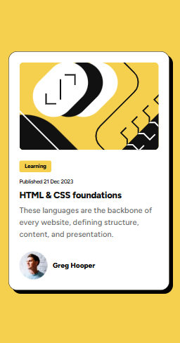

👋 Welcome!

Thanks for checking out this front-end coding challenge!
This solution was built as part of the Frontend Mentor Blog Preview Card challenge.

Tools & Techniques Used:
- Mobile-first approach
- CSS Variables (Design Tokens)
- Fluid Typography using clamp()
- Interactive hover effect (card elevation & image zoom)
- BEM naming convention
- Custom font (Figtree) with @font-face

🧠 The Challenge

Build the blog preview card and make it look as close as possible to the design.

✔ Users should be able to:
- See hover & focus states on interactive elements
- View the layout properly on mobile & desktop screens
- See an elevation & image zoom effect on card hover

🔍 Screenshot

Desktop

Mobile

📁 Folder Structure

project/
 ├─ assets/
 │   ├─ images/
 │   └─ fonts/
 ├─ src/
 │   └─ style.css
 ├─ index.html
 ├─ STYLEGUIDE.md
 └─ README.md

 ⚙ Technologies Used

| Tech          | Purpose                   |
| ------------- | ------------------------- |
| HTML5         | Structure                 |
| CSS3          | Styling & Layout          |
| CSS Variables | Reusable design tokens    |
| `clamp()`     | Responsive font sizes     |
| BEM           | Maintainable class naming |
| Figtree Font  | Typography                |
| Mobile-first  | Layout strategy           |

🚀 My Approach

1. Analyze the design – color, spacing, typography
2. Set up CSS Variables in :root for theme scalability
3. Write semantic HTML (<article>, <time>, <section>)
4. Designed mobile-first, then scaled up to desktop
5. Added hover effects:
    - Card elevation using box-shadow
    - Image zoom using transform: scale()
7. Used clamp() for fluid typography

🧪 Accessibility Features

- alt attributes on images
- Semantic HTML elements (article, time, section)
- Good color contrast
- Focus & hover states
- Responsive across 320px and up

🚀 Future Improvements

- Add dark mode support (easy with CSS variables)
- Add theme switcher
- Add more reusable card components

🏁 Final Thoughts

This was a fun challenge and great practice for responsive design & CSS architecture.
Looking forward to more Frontend Mentor challenges! 🚀